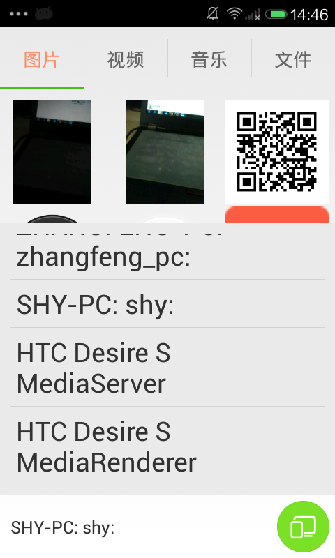

# DLNA-Sample-With-Cyberlink

sample MediaServer, MediaRenderer, ControlPoint

modify some  bugs in cyberlink

reference:

https://github.com/cybergarage/cybergarage-upnp

https://github.com/chrisbanes/Android-PullToRefresh

https://github.com/dotfeng/TabViewPagerIndicator

https://github.com/NanoHttpd/nanohttpd

https://github.com/MustafaFerhan/DebugLog
